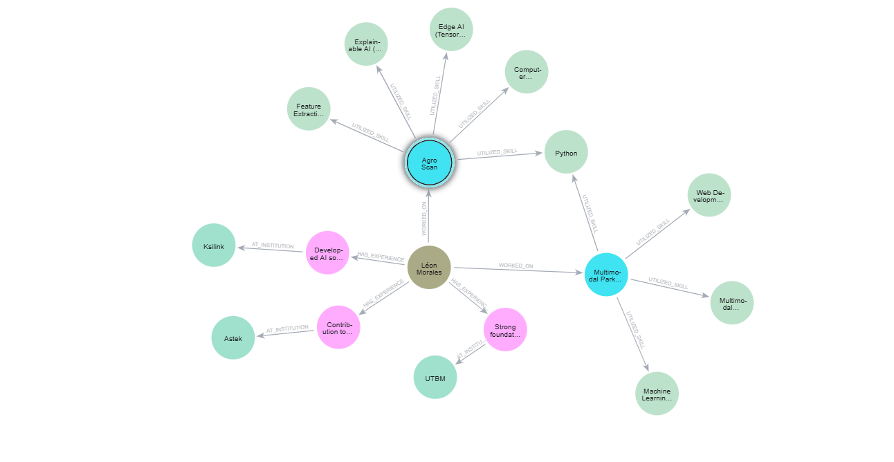

  

  <h1>Hi there, I'm Léon Morales</h1>
  

  

    
     
  

  

---

### About Me

I am an **AI Engineering student** completing a dual-degree program between the **University of Technology of Belfort-Montbéliard (UTBM, France)** and the **Université du Québec à Chicoutimi (UQAC, Canada)**. 

I specialize in **Machine Learning, Deep Learning, and Computer Vision**, with a strong focus on applying AI to real-world challenges (Healthcare, Agriculture, Document Digitalization). I combine robust academic research with hands-on industrial experience.

- **Upcoming:** Joining **Astek Innovation Lab** (Paris - La Défense) in Sept 2026 as an R&D Intern, focusing on End-to-End Agentic AI Platforms.
- **Previously:** AI Engineering Intern at **Ksilink** (Strasbourg), working on LLM-based chatbots, Graph RAG, and Biomedical Computer Vision.
- **Contact:** [leon.morales@utbm.fr](mailto:leon.morales@utbm.fr) or via [LinkedIn](https://www.linkedin.com/in/léon-morales).

 

  
  
<i>A graph representation of my skills, projects, and experiences modeled in Neo4j.</i>

 

---

### Core AI/ML Skills & Tools

* **Languages:** Python (Primary), SQL, Cypher, C/C++
* **AI/ML Frameworks:** PyTorch, TensorFlow/Keras, TensorFlow Lite, Scikit-learn, XGBoost, Hugging Face
* **Specialized Areas:** Deep Learning (CNNs, Transformers), Computer Vision, Multimodal AI, Graph RAG, Agentic AI, Self-Supervised Learning
* **Databases & Tools:** Neo4j (Certified Professional), Git, Weights & Biases (WandB), Flutter

  

---

### Publications & Research

* **[Sample-Efficient Contrastive Learning for Multivariate Time Series](https://github.com/Leon-afk1/Sample-Efficient_Contrastive_Learning)** 
    * Co-authored a scientific paper titled *"Sample-Efficient Self-Supervised Contrastive Learning for Robust and Generalizable Multivariate Time Series Classification"*. 
    * The research proposes a two-phase contrastive learning framework using a lightweight Spatial Dilated Convolution Network (SDCNet) for fine-grained hand gesture recognition via wearable sensors.
    * Evaluated on data collected from commercial accelerometer and PPG wristbands, the approach successfully reduces annotation costs by 70% while outperforming fully-supervised baselines. 
    * *Status:* Submitted to the Journal of IEEE Internet of Things and currently under peer review.

---

### Featured Projects

#### Public Repositories

  
  
   
  
  
   
  

#### Key Industrial Experience (Ksilink - Proprietary Code)

| Domain / Focus | Description |
| :--- | :--- |
| **LLM-based Chatbot & Graph RAG** | Designed a conversational agent using open-source LLMs and Neo4j to query complex biomedical knowledge graphs in natural language. |
| **Multimodal Contrastive Learning** | Implemented GFlowNets concepts to integrate molecular SMILES data and cell image features for drug discovery. |
| **Cell Classification CNN** | Built robust CNNs (PyTorch/Lightning) to classify cell types from biomedical images with noisy labels. |

---

### GitHub Stats

  

